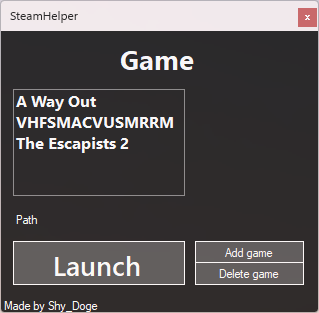

<a name="readme-top"></a>

<!-- PROJECT LOGO -->
<br />
<div align="center">
  <a href="https://github.com/Shy-Doge/SteamHelper">
    
  </a>

<h3 align="center">SteamHelper</h3>

  <p align="center">
    A program that allows you to play other games using Steam features like Remote Play Together.
    <br />
    <br />
    <a href="https://github.com/Shy-Doge/SteamHelper/issues">Report Bug</a>
    ·
    <a href="https://github.com/Shy-Doge/SteamHelper/issues">Request Feature</a>
  </p>
</div>


<!-- TABLE OF CONTENTS -->
<details>
  <summary>Table of Contents</summary>
  <ol>
    <li>
      <a href="#about-the-project">About The Project</a>
      <ul>
        <li><a href="#built-with">Built With</a></li>
      </ul>
    </li>
    <li>
      <a href="#getting-started">Getting Started</a>
      <ul>
        <li><a href="#to-set-it-up">To set it up</a></li>
        <li><a href="#to-build-it">To build it</a></li>
      </ul>
    </li>
    <li><a href="#contributing">Contributing</a></li>
    <li><a href="#contact">Contact</a></li>
  </ol>
</details>


<!-- ABOUT THE PROJECT -->
## About The Project

This project was created in less than 1 hour so I could play games or emulators using Remote Play Together from Steam. Since adding the games as a Non-Steam Game doesn’t get the option to use Remote Play Together, I made this program that allows you to add as many games to it so you can use all Steam features with them.
I decided to share it since I might not be the only one that prefers Remote Play Together over any other program available.

<p align="right">(<a href="#readme-top">back to top</a>)</p>


### Built With

This project was completely made using C#.

<p align="right">(<a href="#readme-top">back to top</a>)</p>


<!-- GETTING STARTED -->
## Getting Started

### To set it up

 1. You will need to have Spacewar installed on Steam, to get it type this into your browser, it will ask you to open with Steam.
```sh
steam://install/480/
   ```
 2. Once installed, right click Spacewar on your library, Manage > Browse local files.

 3. Delete everything on it and paste the .exe from the <a href="https://github.com/Shy-Doge/SteamHelper/releases">Releases Page.</a>

 4. Rename the .exe from SteamHelper to SteamworksExample.
 
Now you can launch Spacewar on Steam and it will launch SteamHelper.

<br />
<br />

### To Build it

### Prerequisites

Visual Studio 2022

### Installation

 Clone the repo using Visual Studio

<p align="right">(<a href="#readme-top">back to top</a>)</p>


<!-- CONTRIBUTING -->
## Contributing

Contributions are what make the open source community such an amazing place to learn, inspire, and create. Any contributions you make are **greatly appreciated**.

If you have a suggestion that would make this better, please fork the repo and create a pull request. You can also simply open an issue with the tag "enhancement".
Don't forget to give the project a star! Thanks again!

1. Fork the Project
2. Create your Feature Branch (`git checkout -b feature/AmazingFeature`)
3. Commit your Changes (`git commit -m 'Add some AmazingFeature'`)
4. Push to the Branch (`git push origin feature/AmazingFeature`)
5. Open a Pull Request

<p align="right">(<a href="#readme-top">back to top</a>)</p>


<!-- CONTACT -->
## Contact

<!-- Your Name - [@twitter_handle](https://twitter.com/twitter_handle) - email@email_client.com -->

Project Link: [https://github.com/Shy-Doge/SteamHelper](https://github.com/Shy-Doge/SteamHelper)

<p align="right">(<a href="#readme-top">back to top</a>)</p>
